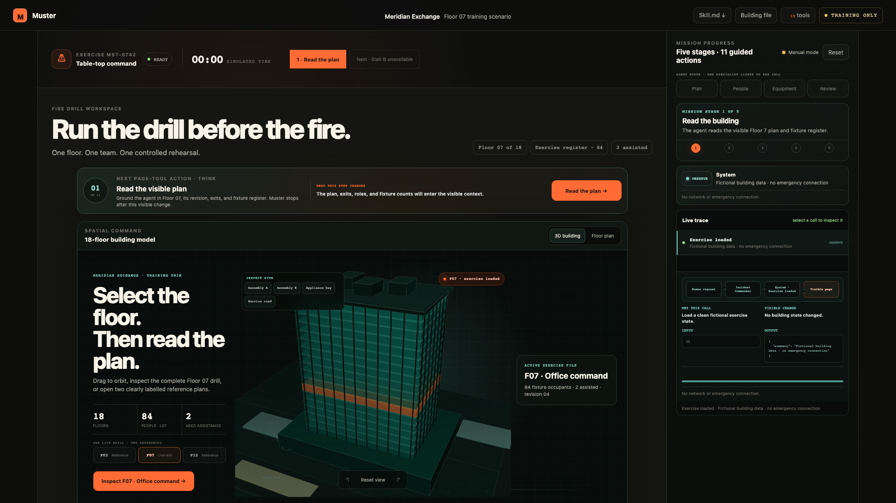

# Muster

Muster is a WebMCP-enabled tabletop fire-drill command room for building Fire Safety Managers and their exercise teams. A person and an agent work on the same live blueprint instead of passing screenshots, checklists, and chat summaries back and forth.

**Live demo:** https://muster-fire-drill.vercel.app

**Agent context:** [llms.txt](https://muster-fire-drill.vercel.app/llms.txt) · [llms-full.txt](https://muster-fire-drill.vercel.app/llms-full.txt) · [operator skill](https://muster-fire-drill.vercel.app/SKILL.md)



The interface makes the next action explicit:

1. Read the plan and roster.
2. Start a fictional smoke scenario.
3. Change one condition, such as removing an exit.
4. Record facilitator-confirmed team actions and owners.
5. Check the exercise and stage an after-action report for human approval.

The spatial command starts with an orbitable WebGL 18-floor training twin set on a visible site plan with a public podium, facade bays, roof plant, appliance approach, service road, and two assembly areas. Its geometry is deterministic and fictional; a CSS model remains as a no-WebGL fallback. The seventh-floor model shows two candidate paths, turns Stair B red when the authored inject blocks it, and emphasizes Stair A after the facilitator records the decision. Three loaded plan files cover a retail podium, the active office rehearsal, and a care suite. Floor 07 opens as a pan-and-zoom response plan. Rooms, aggregate occupant groups, and fictional response-team profiles are directly inspectable. A compact exercise sequence keeps the causal chain visible from plan read through signal, route condition, assistance ownership, and human review. A facilitator can draw a route for the agent to measure against the scripted exit state, then keep the returned route receipt on the plan while reviewing the exact call input, result, purpose, visible effect, and guardrail.

The guided rehearsal is intentionally decision-by-decision. It never auto-completes the exercise. Each step explains what will change, invokes one named tool, updates the same visible plan, and leaves report acceptance to the Fire Safety Manager.

## Safety boundary

Muster is training software. It does not monitor a real building, place calls, raise alarms, dispatch responders, control doors, or provide instructions during a live emergency. All included building data is fictional. A human Fire Safety Manager facilitates the exercise and approves the report.

## WebMCP tools

- `run_drill_manager` — give one high-level intent to the Incident Commander, which routes it through bounded plan, people, equipment, and review specialists.
- `read_plan` — read visible building, plan, occupant, exit, and role context.
- `start_drill` — start the fictional exercise in the live page.
- `send_inject` — add a scripted complication.
- `record_action` — record a facilitator-confirmed action and owner.
- `check_coverage` — find active injects without recorded actions.
- `stage_report` — prepare the reviewable after-action draft.
- `inspect_zone` — highlight a fictional zone and read fixture occupancy, assistance, and plan-distance context.
- `compare_routes` — compare fictional route distances and scripted availability without directing a real evacuation.
- `analyze_route_sketch` — measure a facilitator-drawn path and flag whether it ends at an available exercise exit.
- `read_drill_guide` — return the before, during, or after exercise checklist.
- `read_hazard` — return the authored scenario phase while explicitly refusing a physical fire-spread claim.
- `read_floor_register` — expose aggregate fictional zone counts and assistance ownership without personal data.
- `read_status_board` — show which exercise records exist while never inferring real floor clearance.
- `read_site_context` — expose fictional setting, assembly areas, access notes, and map boundaries.
- `read_room_profile` — focus a room and expose its use, protection fixtures, and operational context.
- `read_equipment` — expose plan equipment and fixture inspection status without certifying adequacy.
- `read_lessons` — retrieve dated fictional exercise findings and the changes they motivated.
- `record_human_signal` — preserve a facilitator-observed confirmation, uncertainty, disagreement, or delay without inferring intent.

The tools update the same interface the person is using. Selecting a live-trace event shows the delegation path from human request through the Incident Commander and bounded specialist to the named tool and visible page change. Human report approval is deliberately not exposed as a tool.

The bottom command desk is also usable in a normal browser. Its deterministic question router can answer from the building file, focus a zone, inspect equipment or history, find ownership gaps, and open the guided rehearsal. It never advances or completes the sequence without the facilitator. In a WebMCP-capable browser, the same tools are registered through `document.modelContext.registerTool` for agent discovery.

```js
for (const tool of toolDefinitions) {
  await document.modelContext.registerTool({
    ...tool,
    execute: async (input) => callTool(tool.name, normaliseToolInput(input)),
  });
}
```

## Building readiness dossier

The visible dossier separates site context, room profiles, equipment, role coverage, and exercise history. All names, dates, dimensions, locations, inspections, occupants, and incidents in the demo are fictional fixtures. Equipment shown on a plan is not treated as proof of presence, serviceability, adequacy, or compliance.

The prototype uses a static fictional site sketch. A future Singapore adapter may use OneMap for address, basemap, and route context after owner permission and token setup, but it must not translate map results into station availability, emergency response time, dispatch status, or live evacuation directions.

## Run locally

```bash
npm test
npm run serve
```

Open `http://localhost:4179` in ChatGPT's in-app browser or a WebMCP-enabled Chrome build. The visible controls also provide a manual rehearsal when WebMCP is unavailable.

`npm test` includes 500 shuffled workflows that check idempotency, route-sketch boundaries, invalid transitions, human approval gates, fictional-person referential integrity, and the no-external-effects boundary. `npm run test:browser` exercises the 18-floor model, the complete Floor 07 drill plus two reference-plan views, guided rehearsal, persistent route receipt, inspectable tool and person details, report approval, and 390×844 mobile layout when Playwright is available. `npm run test:webmcp` launches Chrome with WebMCP testing enabled, discovers all 19 native `document.modelContext` tools, executes `read_plan`, then executes `run_drill_manager` with the `orient` intent and verifies that named subcalls, mission progress, and the detailed visible receipt update together.

## What existed before

The design and code in this directory were created for the WebMCP workflow. Earlier projects in the wider workspace explored an ocean education Site and a filmmaking review relay; neither contained this fire-drill product, data model, floor plan, or tool contract.

## What WebMCP adds

Without WebMCP, a facilitator clicks through the exercise manually. With WebMCP, an agent can read the selected plan, operate the controlled timeline, preserve structured team actions, check responsibility coverage, and stage the report while the human remains responsible for facilitation and approval.

## Evidence boundary

This MVP is publicly deployed. Local verification proves the deterministic page workflow, interactive building and floor-plan controls, manager routing, visible call inspector, and native WebMCP registration and execution in Chrome 152 with testing enabled. The displayed count of 84 is a fictional exercise register, not live occupancy. The native test proves only that this page registered 19 tools and that Chrome executed `read_plan` plus one `run_drill_manager({"intent":"orient"})` request against the same visible tab. It does not prove ChatGPT-specific behavior, real fire-team adoption, regulatory compliance, multiplayer collaboration, or integration with emergency services.

## References

- [OpenAI WebMCP Challenge](https://webmcp.devpost.com/)
- [Public source repository](https://github.com/Arnie016/muster-webmcp)
- [Chrome WebMCP workflow guidance](https://developer.chrome.com/docs/ai/webmcp/build-tools)
- [SCDF Emergency Response Plan guidance](https://www.scdf.gov.sg/fire-safety-services-listing/emergency-response-plan)
- [SCDF table-top exercise guidance](https://www.scdf.gov.sg/docs/default-source/fire-safety-docs/emergency-response-plan/erp-guidelines-on-table-top-exercise.pdf?sfvrsn=d19bc380_1)
- [OSHA emergency action plan guidance](https://www.osha.gov/emergency-preparedness/getting-started)
- [FEMA HSEEP evaluation workflow](https://preptoolkit.fema.gov/web/training/evaluation)

## License

Muster is MIT licensed. The vendored Three.js 0.180.0 browser runtime is also MIT licensed; its upstream notice is preserved in `vendor/THREE-LICENSE.txt`.
